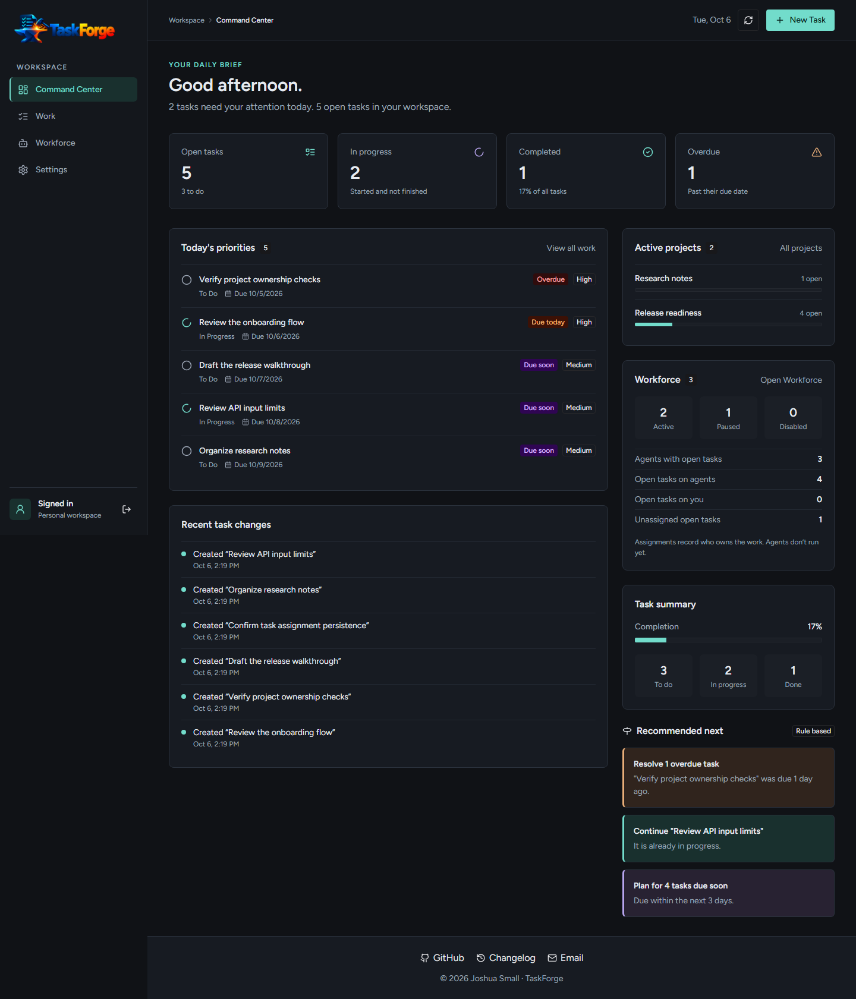
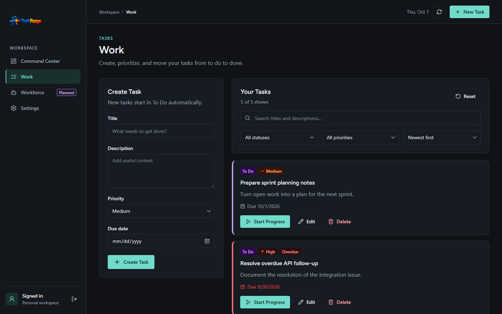
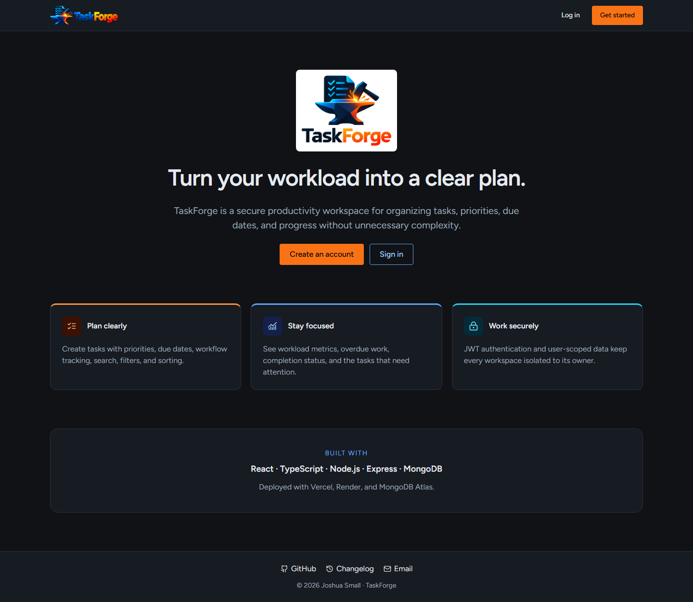
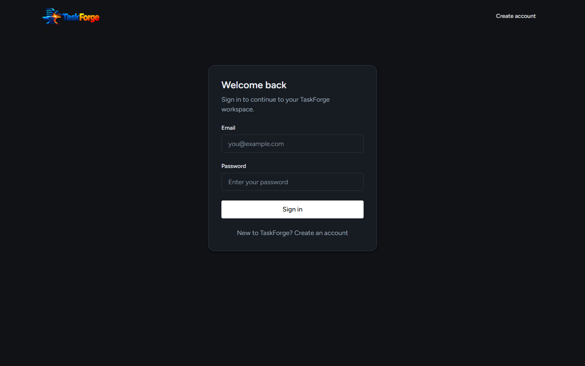
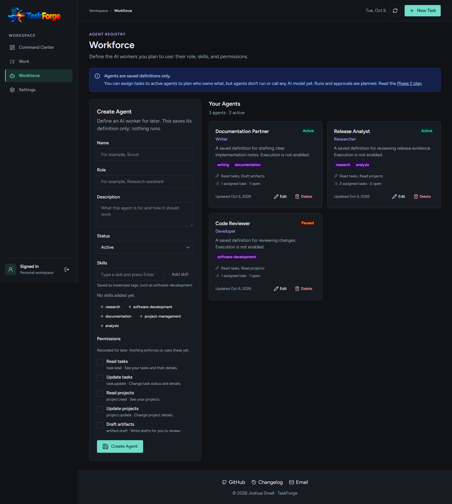
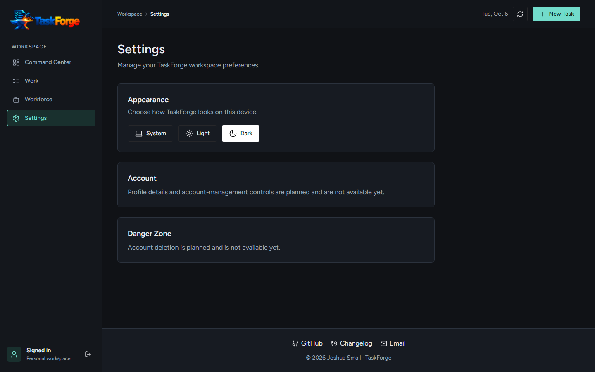
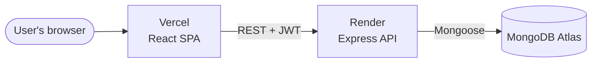

<p align="center">
  
</p>

<p align="center">
  <strong>A secure, full-stack task workspace — being built into a personal AI orchestration platform.</strong>
</p>

<p align="center">
  <a href="https://taskforge-alpha-six.vercel.app"><strong>Live demo</strong></a> ·
  <a href="docs/architecture.md">Architecture</a> ·
  <a href="docs/roadmap.md">Roadmap</a> ·
  <a href="docs/project-status.md">Status</a> ·
  <a href="CHANGELOG.md">Changelog</a>
</p>

<p align="center">
  <a href="https://github.com/WasteOfADrumBum/TaskForge/actions/workflows/ci.yml"></a>
</p>

---

## Overview

TaskForge is a production-deployed task management app built with React, TypeScript, Node.js, Express, and MongoDB. Users create an account, sign in, and manage their own private tasks with priorities, due dates, status tracking, search, and filters, starting each day from a task-driven Command Center.

It is also the foundation for a larger goal: a personal AI orchestration platform with agents, shared knowledge, and a daily command center. **Those AI capabilities are planned, not built.** See the [roadmap](docs/roadmap.md) for exactly what exists today.

> **Live demo:** https://taskforge-alpha-six.vercel.app
>
> The API runs on Render's free tier and sleeps when idle, so the first request after a quiet period can take up to a minute.

## Screenshots

Captured from the live app with sample data. More details are in [docs/images](docs/images/README.md).

**Command Center**: the daily brief, task metrics, today's priorities, and rule-based recommendations.



**Work**: create, filter, and move tasks through To Do, In Progress, and Done.



| Landing page                                  | Sign in                           |
| --------------------------------------------- | --------------------------------- |
|  |  |

| Workforce (earlier placeholder, before the Agent Registry) | Settings                              |
| ---------------------------------------------------------- | ------------------------------------- |
|         |  |

## Key features

- **Accounts and authentication.** Register and sign in with email and password. Passwords are hashed with bcrypt; sessions use signed JWTs.
- **Private, user-owned data.** Every task, project, and agent query on the server is scoped to the signed-in user. One user can never read or change another user's tasks, projects, or agents, or attach a task to another user's project or agent.
- **Task management.** Create, edit, and delete tasks with a title, description, status (to do / in progress / done), priority (low / medium / high), and due date.
- **Projects.** Group tasks into private projects (active / completed / archived). Each project has its own page with tasks, progress, and activity. Deleting a project keeps its tasks and simply unassigns them.
- **Search, filter, and sort.** Search by text, filter by status and priority, and sort by created date, due date, or priority.
- **Command Center.** A daily brief with open, in-progress, completed, and overdue metrics, plus today's priorities, a completion summary, and recent task changes. Its "Recommended next" suggestions come from fixed rules over your tasks, are labeled "Rule based", and are not AI.
- **App shell.** A persistent sidebar and top bar (current section, date, refresh, New Task). On phones the sidebar becomes a drawer.
- **Session-expiration handling.** Expired or rejected sessions sign the user out cleanly and explain why (see below).
- **Dark-first theme.** A dark command-center look with teal, orange, and violet accents. Light and system modes are available on the Settings page.
- **Polished UI.** Landing page, auth pages, and workspace built with Chakra UI v3; routes are lazy-loaded.
- **Agent Registry (Workforce).** Define private AI workers with a role, description, status (active / paused / disabled), skill tags, and permission identifiers, each with its own detail page. Task assignment shipped in PR #15, with matching client/API source identity verified under KAN-11. You can assign tasks to yourself or to an active agent, and see each agent's assigned and open tasks. Assignments only record who owns the work: agents don't run or call any AI model yet, and the app says so.

## Tech stack

| Layer    | Technology                                                               |
| -------- | ------------------------------------------------------------------------ |
| Frontend | React 19, TypeScript, Vite, Chakra UI v3, Redux Toolkit, React Router v7 |
| API      | Node.js 24, Express 5, TypeScript (ESM), Mongoose                        |
| Database | MongoDB Atlas                                                            |
| Auth     | bcrypt password hashing, JSON Web Tokens (`jsonwebtoken`)                |
| Testing  | Vitest + Testing Library (client), Jest + supertest (server)             |
| Quality  | ESLint 9 (flat config), Prettier, TypeScript strict mode, `npm audit`    |
| CI       | GitHub Actions                                                           |
| Hosting  | Vercel (frontend), Render (API)                                          |

## Architecture



- **Client** (`client/`): a React single-page app served by Vercel. It calls the API over HTTPS with `Authorization: Bearer <token>`.
- **API** (`server/`): an Express app layered as `routes → controllers → services → models`. Task, project, and agent routes require a valid JWT, and every resource query is filtered by owner.
- **Database:** MongoDB Atlas, accessed through Mongoose models for users, tasks, projects, and agents.

Full details, including the auth, deployment, and CI flows, are in [docs/architecture.md](docs/architecture.md).

## Authentication and sessions

1. On login, the API verifies the bcrypt password hash and returns a JWT signed with `JWT_SECRET`. Tokens expire after **7 days**.
2. The client stores the token in `localStorage` and sends it on every authenticated task, project, and agent request.
3. The API's `requireAuth` middleware rejects missing, malformed, wrongly signed, or expired tokens with `401`.
4. When an authenticated resource request gets a `401`, the client clears the token and all task, project, and agent data and returns to the login page with a "session expired" message.
5. A response that arrives after the user has logged out or logged in again is discarded, so an old request can never sign out a new session.
6. Protected pages also check the token's expiry before rendering. This is a UX check only; the server is always the authority.

Logout is stateless: the client discards the token. There is no server-side revocation or refresh token.

## Testing and quality

```bash
npm test               # client (Vitest) + server (Jest)
npm run lint           # ESLint for both workspaces
npm run typecheck      # client TypeScript; server types checked during build
npm run format:check   # Prettier
npm run build          # production builds for client and server
```

- Client tests cover task, project, and agent APIs, session expiration and stale requests, protected routes, resource utilities, and key components.
- Server tests cover auth, task, project, and agent routes, including input validation, owner boundaries, and rejection of missing, expired, forged, and malformed JWTs. Services are mocked, so tests need no database.
- [CI](.github/workflows/ci.yml) runs on every push and pull request to `main`: install → format check → lint → client typecheck → test → build (including server typecheck) → `npm audit`. Main requires current PR CI and independent review before merge; see the [delivery policy](docs/delivery.md).

## Deployment

| Component | Platform      | Config                                     | Notes                                              |
| --------- | ------------- | ------------------------------------------ | -------------------------------------------------- |
| Frontend  | Vercel        | [`client/vercel.json`](client/vercel.json) | SPA rewrites; preview deployments on pull requests |
| API       | Render        | [`render.yaml`](render.yaml)               | Free web service; health check at `/health`        |
| Database  | MongoDB Atlas | `MONGO_URI` env var on Render              | Free tier                                          |

Production URLs:

- App: https://taskforge-alpha-six.vercel.app
- API: https://taskforge-api-rp2m.onrender.com
- API health: https://taskforge-api-rp2m.onrender.com/health

## Local development

**Prerequisites:** Node.js 24+ and npm 11+ (see [`.nvmrc`](.nvmrc)), and a MongoDB connection string (local MongoDB or a free Atlas cluster).

```powershell
git clone https://github.com/WasteOfADrumBum/TaskForge.git
cd TaskForge
npm install

Copy-Item server/.env.example server/.env   # then fill in MONGO_URI and JWT_SECRET
Copy-Item client/.env.example client/.env

npm run dev
```

`npm run dev` starts the client at http://localhost:5173 and the API at http://localhost:5000.

Optional demo data. This creates the demo user (or resets its password) and replaces **all of its tasks, projects, and agents**, so point `MONGO_URI` at a local or development database. Do not run it against production without explicit authorization:

```bash
npm --workspace server run seed:demo   # needs MONGO_URI, DEMO_EMAIL, DEMO_PASSWORD
```

## Environment variables

**Server** (`server/.env`, see [`.env.example`](server/.env.example)):

| Variable        | Required  | Purpose                                                          |
| --------------- | --------- | ---------------------------------------------------------------- |
| `MONGO_URI`     | Yes       | MongoDB connection string                                        |
| `JWT_SECRET`    | Yes       | Secret used to sign and verify JWTs                              |
| `PORT`          | No        | API port (default `5000`)                                        |
| `CLIENT_ORIGIN` | No        | Comma-separated CORS allowlist (default `http://localhost:5173`) |
| `DEMO_EMAIL`    | Seed only | Demo account email for `seed:demo`                               |
| `DEMO_PASSWORD` | Seed only | Demo account password for `seed:demo`                            |

**Client** (`client/.env`, see [`.env.example`](client/.env.example)):

| Variable            | Required | Purpose                                        |
| ------------------- | -------- | ---------------------------------------------- |
| `VITE_API_URL`      | No       | API base URL (default `http://localhost:5000`) |
| `VITE_LINKEDIN_URL` | No       | LinkedIn link shown in the footer              |

Never commit real `.env` files; `.env*` is git-ignored except the `.env.example` templates and the non-secret `client/.env.test`.

## $0-extra-cost architecture

TaskForge is designed to run with **no recurring infrastructure or API cost**. Every service is on a free tier (Vercel, Render, MongoDB Atlas, GitHub Actions), and the tradeoffs — such as Render cold starts — are accepted and designed around rather than paid away.

Future AI features will go through a provider abstraction (chat, embeddings, structured output) with a local, free option such as Ollama as the default. TaskForge will not be hard-wired to any single paid AI provider. This is planned work; see [Phase 2](docs/phases/phase-2-ai-workforce.md).

## Roadmap and status

- [Roadmap](docs/roadmap.md): the source of truth for what is complete, in progress, and planned across all phases.
- [Project status](docs/project-status.md): the current checkpoint, production URLs, and latest validation results.
- [Changelog](CHANGELOG.md): notable changes.

**Phase 1 — Stabilize TaskForge** is complete: the app is live, verified in production, and on free-tier infrastructure. Current focus: the foundation for **Phase 2 — AI Workforce** (agent registry, runs, human approval, provider abstraction). Work + Projects is done, the Agent Registry stores agent definitions, and task assignment shipped in PR #15 with client/API release identity verified under KAN-11. No AI execution, runs, or approvals are built yet.

## About this project

TaskForge is a portfolio project by [Joshua Small](https://github.com/WasteOfADrumBum), built to show senior-level, end-to-end engineering in the open:

- full-stack TypeScript with a clear layered API and enforced data-ownership boundaries;
- tested behavior, including security edge cases such as expired and forged tokens;
- CI, cloud deployment, and documented architecture;
- a deliberate, cost-aware path toward practical AI features with human-in-the-loop control.

## License

Released into the public domain under [The Unlicense](LICENSE).
