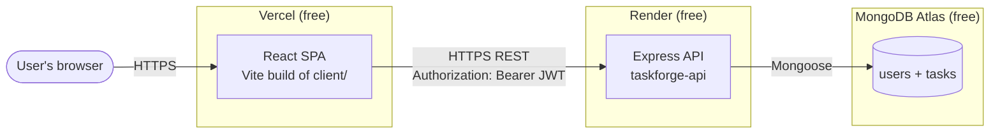
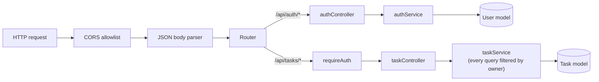
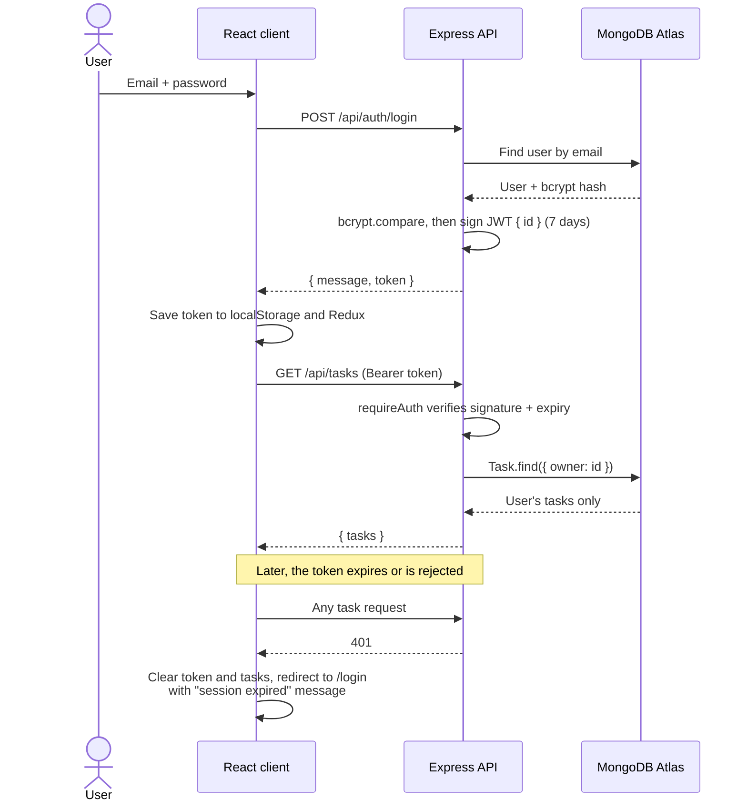
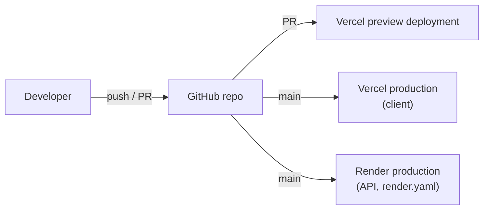
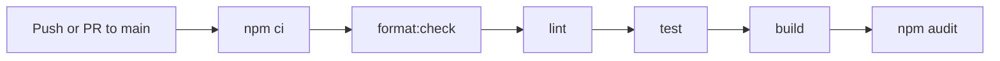

# TaskForge Architecture

How TaskForge is built and deployed **today**. Planned AI features are not shown here; see the [roadmap](roadmap.md).

## System overview

| Piece    | Where         | What it does                                                                    |
| -------- | ------------- | ------------------------------------------------------------------------------- |
| Frontend | `client/`     | React 19 SPA. Renders pages, holds auth and task state in Redux, calls the API. |
| API      | `server/`     | Express 5 REST API. Auth, validation, and owner-scoped task CRUD.               |
| Database | MongoDB Atlas | Stores `users` (email, bcrypt hash) and `tasks` (with an `owner` user id).      |

## Frontend

- Built with Vite and served by Vercel as static files. `client/vercel.json` rewrites every path to `index.html` so client-side routes like `/home` work on refresh.
- Routing (React Router v7) with lazy-loaded pages:
  - Public: `/` (landing), `/login`, `/register`.
  - Authenticated: `/home` (Command Center), `/work` (task workspace), `/workforce` (planned-feature placeholder), and `/settings`. All four sit behind `ProtectedRoute` inside a shared `AppShell` layout.
- The `AppShell` provides the sidebar (a drawer below the `lg` breakpoint), the top bar, and the skip-to-content link. It loads the user's tasks once per session; the top bar's refresh action reloads them.
- State (Redux Toolkit): an `auth` slice (token, loading, error) and a `tasks` slice (items, loading, error).
- API layer (`client/src/api/`): plain `fetch`. Task calls go through `authenticatedFetch`, which handles `401` responses and stale requests.
- The API base URL comes from `VITE_API_URL` at build time.

## API

Request flow inside the Express app:

| Endpoint                  | Auth | Purpose                          |
| ------------------------- | ---- | -------------------------------- |
| `GET /`                   | No   | Plain-text "API is running" page |
| `GET /health`             | No   | Liveness check used by Render    |
| `POST /api/auth/register` | No   | Create an account                |
| `POST /api/auth/login`    | No   | Verify credentials, return a JWT |
| `POST /api/auth/logout`   | No   | Stateless acknowledgement        |
| `GET /api/tasks`          | JWT  | List the signed-in user's tasks  |
| `POST /api/tasks`         | JWT  | Create a task owned by the user  |
| `PATCH /api/tasks/:id`    | JWT  | Update one of the user's tasks   |
| `DELETE /api/tasks/:id`   | JWT  | Delete one of the user's tasks   |

`server/src/server.ts` checks that `MONGO_URI` and `JWT_SECRET` are set, connects to MongoDB, and only then starts listening. If either is missing or the database connection fails, the process exits.

## Authentication flow

Notes:

- The server is the only authority on whether a token is valid. The client's expiry check in `ProtectedRoute` only avoids rendering a page that is bound to fail.
- A response to a request sent with an older token is discarded, so it can never sign out a newer session.
- Logout is stateless (the client drops the token). There are no refresh tokens and no server-side revocation.

## Deployment flow

- **Vercel** builds the client from GitHub. Pull requests get preview deployments; `main` deploys to production.
- **Render:** `render.yaml` defines the API build (`npm ci --include=dev && npm run build --workspace server`), start command (`npm run start --workspace server`), and `/health` health check. Whether the live service is synced to this Blueprint is a dashboard setting; confirm it in Render.
- Auto-deploy behavior is configured in the Vercel and Render dashboards, not in this repository.

## CI flow

Defined in `.github/workflows/ci.yml` (Node 24, Ubuntu). CI is a quality gate for pull requests. It is **not** wired as a gate in front of Vercel or Render; those platforms are expected to deploy on their own when `main` changes (per their dashboard settings), so `main` should only change through PRs with green CI.

## Environment boundaries

| Environment | Client                                 | API                                                | Database               |
| ----------- | -------------------------------------- | -------------------------------------------------- | ---------------------- |
| Local       | Vite dev server, `:5173`               | nodemon + ts-node, `:5000`                         | Local MongoDB or Atlas |
| Test        | Vitest + jsdom                         | Jest + supertest (services mocked)                 | None                   |
| Preview     | Vercel preview URL per PR              | Whatever Vercel's Preview `VITE_API_URL` points to | Same as that API       |
| Production  | https://taskforge-alpha-six.vercel.app | https://taskforge-api-rp2m.onrender.com            | MongoDB Atlas          |

- Secrets (`MONGO_URI`, `JWT_SECRET`, demo credentials) live only in Render's environment settings and local `.env` files, which are git-ignored.
- `CLIENT_ORIGIN` on Render controls which browser origins the API accepts (CORS).
- The client only knows the API URL (`VITE_API_URL`); it holds no secrets.
- If a preview deployment points at the production API, its requests only succeed when the preview origin is in `CLIENT_ORIGIN`; otherwise the browser blocks them.

## Free-tier constraints

TaskForge must add **$0 in recurring cost** unless explicitly approved. The free tiers shape the design:

| Constraint                                                     | Impact                                           | How TaskForge handles it                                    |
| -------------------------------------------------------------- | ------------------------------------------------ | ----------------------------------------------------------- |
| Render free web services sleep after inactivity                | First request after idle can take up to a minute | Documented; improving this is tracked as "demo reliability" |
| Render free instances have limited CPU and memory              | No heavy background work in the API process      | API stays a thin, stateless REST layer                      |
| MongoDB Atlas free tier has limited storage and shared compute | Not suited to large data or heavy analytics      | Small per-user documents; indexes on `owner`                |
| No paid AI APIs                                                | AI features can't depend on a hosted model       | Planned provider abstraction with a local (Ollama) default  |
