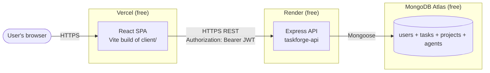
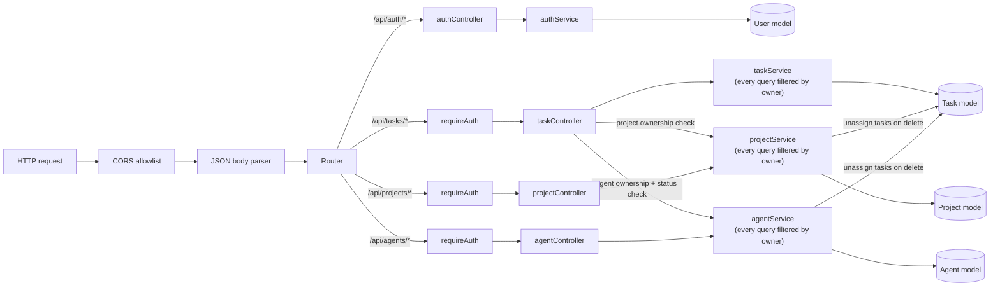
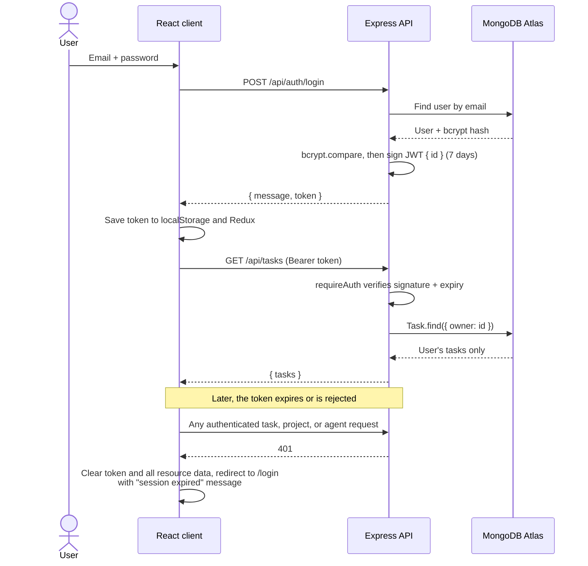
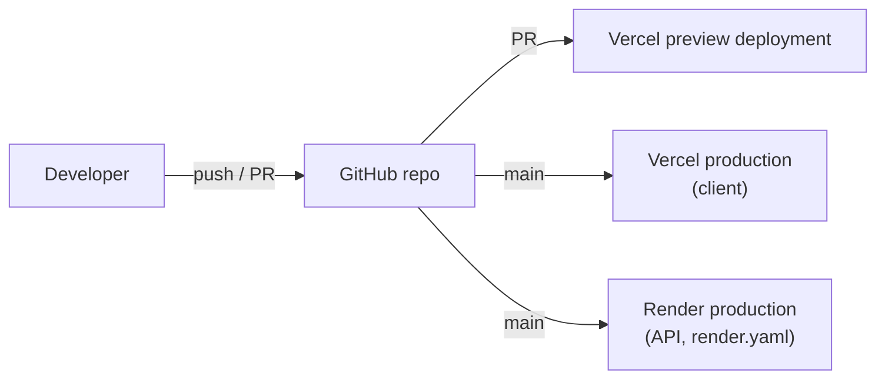
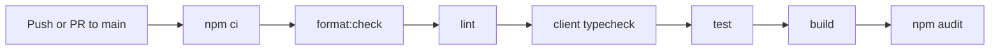

# TaskForge Architecture

How TaskForge is built and deployed **today**. Planned AI features are not shown here; see the [roadmap](roadmap.md).

## System overview

| Piece    | Where         | What it does                                                                                                                                                                                                  |
| -------- | ------------- | ------------------------------------------------------------------------------------------------------------------------------------------------------------------------------------------------------------- |
| Frontend | `client/`     | React 19 SPA. Renders pages, holds auth, task, project, and agent state in Redux, calls the API.                                                                                                              |
| API      | `server/`     | Express 5 REST API. Auth, validation, and owner-scoped task, project, and agent CRUD.                                                                                                                         |
| Database | MongoDB Atlas | Stores `users` (email, bcrypt hash), `projects`, `tasks`, and `agents`. Projects, tasks, and agents carry an `owner` user id; a task may reference one of its owner's projects and one of its owner's agents. |

## Frontend

- Built with Vite and served by Vercel as static files. `client/vercel.json` rewrites every path to `index.html` so client-side routes like `/home` work on refresh.
- Routing (React Router v7) with lazy-loaded pages:
  - Public: `/` (landing), `/login`, `/register`.
  - Authenticated: `/home` (Command Center), `/work` (tasks), `/work/projects` (projects), `/work/projects/:id` (project detail), `/workforce` (Agent Registry), `/workforce/:id` (agent detail), and `/settings`. All of them sit behind `ProtectedRoute` inside a shared `AppShell` layout.
- The `AppShell` provides the sidebar (a drawer below the `lg` breakpoint), the top bar, and the skip-to-content link. It loads the user's tasks, projects, and agents once per session; the top bar's refresh action reloads all three.
- State (Redux Toolkit): an `auth` slice (token, sessionVersion, loading, error), a `tasks` slice (items, loading, error, loaded), a `projects` slice (items, loading, error, loaded), and an `agents` slice (items, loading, error, loaded). Every data slice resets on logout and on session expiry. When a project or an agent is deleted, the tasks slice unassigns its tasks locally, mirroring the server. Agent workload counts are derived from the tasks slice; there is no separate endpoint. Counts and empty states appear only after a successful task load; pending or failed loads show unknown assignment state and safe deletion wording.
- API layer (`client/src/api/`): plain `fetch`. Task, project, and agent calls go through `authenticatedFetch`, which handles `401` responses and stale requests. Shared helpers live in `api/http.ts`.
- The API base URL comes from `VITE_API_URL` at build time.

## API

Request flow inside the Express app:

| Endpoint                   | Auth | Purpose                                       |
| -------------------------- | ---- | --------------------------------------------- |
| `GET /`                    | No   | Plain-text "API is running" page              |
| `GET /health`              | No   | Liveness check used by Render                 |
| `POST /api/auth/register`  | No   | Create an account                             |
| `POST /api/auth/login`     | No   | Verify credentials, return a JWT              |
| `POST /api/auth/logout`    | No   | Stateless acknowledgement                     |
| `GET /api/tasks`           | JWT  | List the signed-in user's tasks               |
| `POST /api/tasks`          | JWT  | Create a task owned by the user               |
| `PATCH /api/tasks/:id`     | JWT  | Update one of the user's tasks                |
| `DELETE /api/tasks/:id`    | JWT  | Delete one of the user's tasks                |
| `GET /api/projects`        | JWT  | List the signed-in user's projects            |
| `POST /api/projects`       | JWT  | Create a project owned by the user            |
| `GET /api/projects/:id`    | JWT  | Get one of the user's projects                |
| `PATCH /api/projects/:id`  | JWT  | Update one of the user's projects             |
| `DELETE /api/projects/:id` | JWT  | Delete a project; its tasks become unassigned |
| `GET /api/agents`          | JWT  | List the signed-in user's agents              |
| `POST /api/agents`         | JWT  | Create an agent definition owned by the user  |
| `GET /api/agents/:id`      | JWT  | Get one of the user's agents                  |
| `PATCH /api/agents/:id`    | JWT  | Update one of the user's agents               |
| `DELETE /api/agents/:id`   | JWT  | Delete an agent; its tasks become unassigned  |

**Projects and tasks:**

- **Model:** `Project` has `name` (required, up to 120 characters), `description` (up to 2000), `status` (`active`, `completed`, or `archived`), `owner`, and timestamps. `Task.project` is optional and defaults to `null`.
- **Ownership:** every project query filters by `owner`. A task's `project` must be omitted (no change), `null` or `''` (unassign), or the id of a project the same user owns. A malformed id gets `400 Invalid project`. A missing project and another user's project both get `400 Project not found`, so the API never reveals whether another user's project exists. Malformed project ids in URLs get `404`.
- **Deleting a project never deletes tasks.** The service first unassigns the owner's tasks from the project, then deletes the project. If the delete fails after that, the project still exists with no tasks pointing at it, and the request can be retried. After the delete, a second best-effort unassign catches a task the same user assigned to the project at that exact moment. Without a transaction this narrows that window rather than closing it, so the client also treats a reference to an unknown project as Unassigned. Editing such a task leaves its project untouched unless the user changes the Project field.

**Agents (Agent Registry, Phase 2 foundation):**

- **Definitions only.** An agent is a persistent, user-owned record of an AI worker. Tasks can be assigned to it (below); assignment alone starts no work. KAN-18 enforces persisted permissions for explicit draft execution through the owned run API.
- **Model:** `Agent` has `name` and `role` (required, up to 80 characters each), `description` (up to 2000), `status` (`active`, `paused`, or `disabled`), `skills`, `permissions`, `owner`, and timestamps.
- **Skills** are an array of lowercase slug strings (for example `software-development`), up to 20 per agent and 40 characters each. The controller normalizes input (`Software Development` and `software_development` become `software-development`) and removes duplicates. There is no separate Skill collection.
- **Permissions** are identifiers from a fixed catalog: `task.read`, `task.update`, `project.read`, `project.update`, `artifact.draft`. Unknown values are rejected. KAN-18 draft execution checks current task.read and artifact.draft. Project reads additionally require project.read. Write identifiers do not enable automatic task/project changes.
- **Ownership:** every agent query filters by `owner`. Another user's agent gets the same `404 Agent not found` as a missing one, and malformed ids get `404` without a database query. `owner`, `_id`, and timestamps in a request body are ignored.
- **Deleting an agent never deletes tasks.** Same order as deleting a project: unassign the owner's tasks from the agent, delete the agent, then a best-effort second unassign. Task writes also recheck agent existence after persistence and conditionally clear a deleted reference without overwriting a concurrent reassignment. Cleanup remains nontransactional: a database failure can leave a stale reference, which the client labels as deleted. The client preserves assignment input during unrelated edits; the server rechecks the reference on every task write and clears it when the agent no longer exists. A task deleted during create reconciliation returns `404 Task not found`, never a successful null task.

**Task input validation (KAN-8):** malformed update/delete IDs return `404 Task not found` before database access. Titles require nonempty trimmed strings with a 120-code-unit limit; optional descriptions require strings with a 2000-code-unit trimmed limit. Every supplied status/priority must match its enum, including falsy inputs. Invalid types/body shapes and dates return 400 before project/agent resolution. Due dates accept real `YYYY-MM-DD` or exact UTC-midnight API strings, years 1–9999; null clears them and omission preserves them. Model setters reject invalid calendar rollover/non-midnight input, while valid UTC-midnight `Date` instances used by the seed remain supported. Client native text/year limits match; date arithmetic preserves years 1–99 without shifting dates across time zones. No migration or ownership change.

**Task assignment (KAN-2, shipped in PR #15; release identity verified by KAN-11):**

- **Model:** `Task.assigneeType` is `user`, `agent`, or `null` (default, Unassigned). `Task.assigneeAgent` is the agent id when the type is `agent`, otherwise `null`. `user` always means the task's owner.
- **Validation** (task create and update, in `taskController`): both fields omitted leaves the assignment unchanged. `assigneeType` is required whenever `assigneeAgent` is sent. `null`, `''`, and `user` must not carry an agent id (`400 Invalid assignee`). For `agent`, a malformed id gets `400 Invalid agent`, and a missing agent and another user's agent both get `400 Agent not found`. Both fields are always written together, so a reassignment fully replaces the previous assignee.
- **Agent status:** only an `active` agent can take a new assignment (`400 Only active agents can take new tasks`). A task already assigned to a paused or disabled agent keeps it: an update that re-sends the task's current agent is accepted. Pausing or disabling an agent never changes its tasks. The status check and the write are separate queries, so an agent paused in that same moment can still receive the task.
- **Assignment is a record only.** It starts no work. Owned run creation/execution are separate explicit API operations.

A last-resort error handler in `app.ts` keeps every failure in the API's `{ message }` shape: malformed JSON → `400 Malformed JSON body`, an oversized body → `413`, anything else → `500 Server error`. Express's default HTML error page, with its stack trace, is never returned.

`server/src/server.ts` checks that `MONGO_URI` and `JWT_SECRET` are set, connects to MongoDB, and only then starts listening. If either is missing or the database connection fails, the process exits.

## Authentication flow

Notes:

- Auth inputs are validated before database queries or hashing. Email is trimmed, lowercased, shape-checked and limited to 254 characters. Registration requires at least 15 Unicode code points and at most 72 UTF-8 bytes, preventing bcrypt truncation; passwords are not trimmed. Login accepts existing shorter or longer passwords up to 4096 UTF-8 bytes for compatibility. Duplicate registration races return 409. Malformed inputs return 400; incorrect credentials retain the generic 401 response.

- The server is the only authority on whether a token is valid. The client's expiry check in `ProtectedRoute` only avoids rendering a page that is bound to fail.
- A response to a request sent with an older token is discarded, so it cannot sign out a newer session. Authenticated JSON parsing and rejected network requests also recheck the captured token/sessionVersion after their async work, preventing old data/errors from returning after logout or a new login. Stale results use the existing ignored SessionExpiredError path; they do not add a misleading expiration message to a new or absent session. Resource actions/loaders and page save/delete continuations also check the captured token/sessionVersion immediately before consuming results/errors or updating loading/navigation, covering session changes during later promise continuations.
- The client increments an in-memory sessionVersion on login, logout and expiration. Fetch retains that original version with its Response through body parsing, and consumers retain the same snapshot across awaits. Even identical JWT strings after re-login cannot revive old requests. Reload persistence is unnecessary; in-flight JavaScript work does not survive reload. This does not change server JWT lifetime or revoke tokens.
- Logout is local and synchronous: clear the token plus auth/tasks/projects/agents, then replace navigation with login. The UI sends no server acknowledgement because there is no server session to revoke. The compatibility endpoint remains stateless; JWT lifetime is unchanged, with no refresh tokens or revocation.
- Login and registration use layered process capacity and normalized-account throttles before their controllers. Login allows 10 failed attempts/account in 15 minutes (successful responses refund that account quota), with 120 requests/minute process capacity. Registration allows 5 attempts/account/hour and 20 requests/15 minutes process capacity. Keys hash normalized email; malformed email shares an invalid bucket. Forwarded headers do not choose keys and proxy trust remains disabled. Blocked requests return 429, Retry-After and a clear message shown by the existing form error feedback.
- These in-memory limits reset at process restart and do not coordinate multiple instances. Shared capacity can temporarily affect other users under attack; targeted attempts can temporarily exhaust an account quota. No verified per-client IP guarantee or distributed abuse protection is claimed. See the [KAN-7 policy and delivery record](tasks/KAN-7-auth-abuse-protection.md).

## Deployment flow

- **Vercel** builds the client from GitHub. Pull requests get preview deployments; `main` deploys to production.
- **Render:** `render.yaml` defines the API build (`npm ci --include=dev && npm run build --workspace server`), start command (`npm run start --workspace server`), and `/health` health check. Whether the live service is synced to this Blueprint is a dashboard setting; confirm it in Render.
- Auto-deploy behavior is configured in the Vercel and Render dashboards, not in this repository.

## CI flow

Defined in `.github/workflows/ci.yml` (Node 24, Ubuntu). Current PR CI is enforced by main branch protection, including for administrators. Independent review is recorded before merge; see [delivery policy](delivery.md). It is **not** wired as a gate in front of Vercel or Render; those platforms are expected to deploy on their own when `main` changes (per their dashboard settings), so `main` should only change through PRs with green CI.

## Environment boundaries

| Environment | Client                                 | API                                                | Database               |
| ----------- | -------------------------------------- | -------------------------------------------------- | ---------------------- |
| Local       | Vite dev server, `:5173`               | Node watch + ts-node, `:5000`                      | Local MongoDB or Atlas |
| Test        | Vitest + jsdom                         | Jest + supertest (services mocked)                 | None                   |
| Preview     | Vercel preview URL per PR              | Whatever Vercel's Preview `VITE_API_URL` points to | Same as that API       |
| Production  | https://taskforge-alpha-six.vercel.app | https://taskforge-api-rp2m.onrender.com            | MongoDB Atlas          |

- Secrets (`MONGO_URI`, `JWT_SECRET`, demo credentials) live only in Render's environment settings and local `.env` files, which are git-ignored.
- `CLIENT_ORIGIN` on Render controls which browser origins the API accepts (CORS).
- The client only knows the API URL (`VITE_API_URL`); it holds no secrets.
- If a preview deployment points at the production API, its requests only succeed when the preview origin is in `CLIENT_ORIGIN`; otherwise the browser blocks them.

## Operational verification (KAN-11, shipped in PR #16)

`/health` remains liveness. `/ready` performs a bounded, shared database ping and reports 200 ready or 503 unavailable without internal details. `/release` reports the commit embedded from the actual build checkout, independently of Render's deployment metadata. Client builds emit `/release.json` with their checkout commit and effective public API URL. These endpoints and the asset use no-store headers; release identity does not prove database readiness or authenticated feature behavior.

The [release runbook](release-runbook.md) covers source verification, preview API isolation, long-idle recovery, and backup boundaries. Render can wake automatically after sleep; a fully paused Atlas Free cluster requires manual recovery. The current free-tier stack does not guarantee unattended availability after months. No scheduler, cluster administration, production restore, or paid upgrade is introduced.

## Free-tier constraints

TaskForge must add **$0 in recurring cost** unless explicitly approved. The free tiers shape the design:

| Constraint                                                     | Impact                                           | How TaskForge handles it                                                              |
| -------------------------------------------------------------- | ------------------------------------------------ | ------------------------------------------------------------------------------------- |
| Render free web services sleep after inactivity                | First request after idle can take up to a minute | Documented; improving this is tracked as "demo reliability"                           |
| Render free instances have limited CPU and memory              | No heavy background work in the API process      | API stays a thin, stateless REST layer                                                |
| MongoDB Atlas free tier has limited storage and shared compute | Not suited to large data or heavy analytics      | Small per-user documents; indexes on `owner`                                          |
| No paid AI APIs                                                | AI features can't depend on a hosted model       | Disabled production default; explicit simulation; local-only developer Ollama adapter |

## Isolated critical verification

Fast mocked unit suites remain separate from real MongoDB/API integration and Chromium smoke. Test runners create fresh loopback databases and synthetic accounts, refuse existing data/API listeners, and never load production database configuration. Required CI includes startup safety, persisted CRUD/assignment, two-user isolation, session expiry and mobile navigation checks. See [testing](testing.md) for commands and limits; this adds test tooling only and does not change application hosting/database architecture.

## AI provider boundary (KAN-15)

The server-only contract lives in `server/src/ai/provider.ts`, with no client/provider dependency. Default execution is disabled. Explicit canned simulation is labelled and does not use a model; disabled, unavailable and invalid configurations never silently fall back. `/api/ai/status` is authenticated, read-only, and reports safe capability metadata, not secrets or prompts. No execution route or database operation is added. Runtime output validation, deadline and cancellation semantics apply before future runs consume results. KAN-16 adds local-only developer Ollama inference with bounded protocol, cloud rejection and explicit trusted-daemon constraints. Owned runs are implemented; KAN-18 draft permissions/audit are shipped. KAN-19 adds locally validated owner review; PR/CI/deployment verification is pending. See [provider behavior](ai-provider.md).

## Agent run state foundation (KAN-17)

Owned queued run records use the existing MongoDB stack, a unique owner/retry-key index acknowledged before creation, and atomic status/version/attempt fencing with bounded deadlines/leases. Expired running work can be explicitly marked failed, without replay. KAN-18 shipped explicit draft execution with persisted permission rechecks, reused providers, bounded cancellation and atomic lifecycle audit. KAN-19 adds owner review routes and UI; local validation is complete. No worker or task/project write is enabled. See [run boundaries](agent-runs.md).

## Human draft review (KAN-19)

Owned pending draft reads feed the Agent Detail approval panel. Decisions bind canonical result digest, current version/status/owner and literal whole stored output in one audited MongoDB update. Review metadata holds the bounded private note; audit omits note/output/input. Stale or repeated decisions fail, session changes cannot update a new view, and uncertain writes require refresh rather than automatic retry. Approval accepts a draft only; no task/project mutation or new service is introduced. Local validation is complete; PR/CI/deployment verification remains pending.

## Minimal permission-scoped context (KAN-20)

A small server allowlist copies owned task/project notes and source identifiers/update times into the existing Run context, bounded to16KiB. Project inclusion is explicit and saved-permission gated before data reads. Snapshot/digest and claim audit are atomic; ordinary later replacement is blocked. Full source sets and current permissions are rechecked around provider use, while same-source note edits preserve captured as-of content. Notes are serialized untrusted user data, never audit text or new prompt roles. Existing MongoDB/JWT/local-only provider architecture stays; no RAG/ingestion, migration, service or task write. Local QA passed; normal PR/main CI and deployment verification remain pending.
